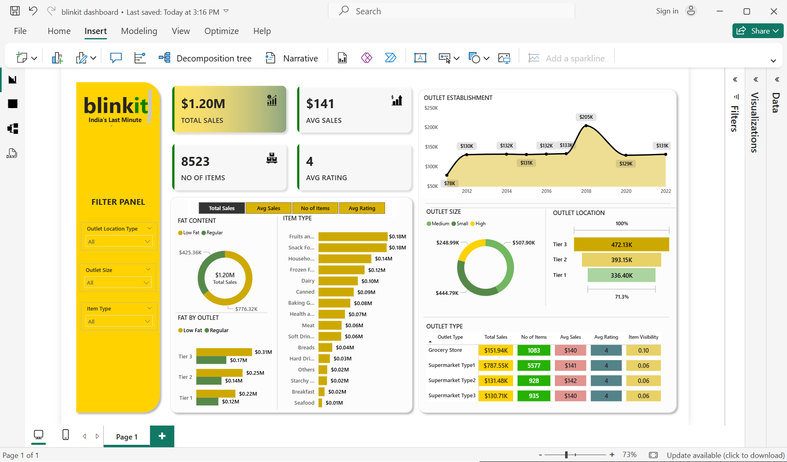

# Blinkit Sales Performance Dashboard

## Overview
This project features an interactive Power BI dashboard designed to analyze the sales performance, outlet distribution, and item-level metrics of Blinkit (India's Last Minute App). The dashboard provides a comprehensive view of how different outlet types and locations contribute to overall revenue, helping identify key growth areas and consumer preferences.

## Key Metrics (KPIs)
* **Total Sales:** $1.20M
* **Average Sales per Item:** $141
* **Total Number of Items:** 8,523
* **Average Rating:** 4.0 / 5.0

## Report Insights & Visualizations

### 1. Outlet Performance & Distribution
* **Outlet Establishment Trends:** Sales show a significant peak around 2018 ($205K) before stabilising in recent years.
* **Outlet Size & Location:** * Medium and Small outlets make up the vast majority of sales compared to 'High' capacity outlets.
    * **Tier 3** locations are the highest revenue generators ($472.13K), followed closely by Tier 2 and Tier 1.
* **Outlet Type Analysis:** *Supermarket Type 1* drives the absolute highest volume of sales ($787.55K) and items sold (5577), significantly outperforming standard Grocery Stores and other Supermarket types.

### 2. Product Level Insights
* **Item Type Popularity:** 'Fruits and Vegetables' and 'Snack Foods' are the top-selling categories (both at roughly $0.18M), indicating a strong consumer preference for daily essentials and quick snacks.
* **Fat Content Preferences:** Consumers show a distinct preference for **Low Fat** products ($776.32K) over Regular fat products ($425.36K), a trend that remains consistent across all Tier 1, 2, and 3 outlets.

## Tools Used
* **Microsoft Power BI:** For data modelling, visualisation, and interactive dashboard creation.
* **DAX (Data Analysis Expressions):** Used for creating custom calculated measures and KPIs.

## Project Files
* `blinkit dashboard.pbix`: The main Power BI file containing the data model and visualisations.
* `interactive_dashboard_screenshot.png`: A static image preview of the final dashboard.
* `BlinkIT Grocery Data.xlsx`: The raw file
